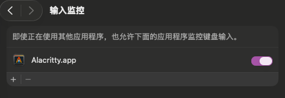
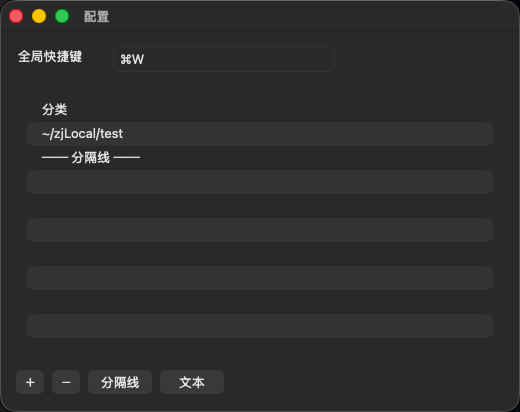
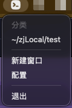

# alacritty 改

# mac 菜单栏 命令窗

cargo run -p alacritty -- -vvv

前置条件

  - 安装 Xcode 命令行工具：xcode-select --install
  - 安装 Rust（rustup，稳定版即可），并确保已更新：rustup update
  - 安装 scdoc（生成手册页用）：brew install scdoc
  - 可选：通用二进制需要目标工具链：rustup target add x86_64-apple-darwin
    aarch64-apple-darwin

  快速生成 .app

  - 在仓库根目录执行：make app
  - 产物位置：target/release/osx/Alacritty.app
  - 安装到系统应用：cp -r target/release/osx/Alacritty.app /Applications/
  - 参考：INSTALL.md:269，Makefile:44

  生成通用(Universal) .app

  - 先添加目标工具链：rustup target add x86_64-apple-darwin aarch64-
    apple-darwin
  - 构建并打包：make app-universal
  - 产物位置同上：target/release/osx/Alacritty.app
  - 参考：INSTALL.md:276，Makefile:45，Makefile:39

  打包成 DMG

  - 原生架构：make dmg
  - 通用架构：make dmg-universal
  - 产物位置：target/release/osx/Alacritty.dmg
  - 参考：Makefile:64

  签名与发布（可选）

  - Makefile 已做临时（Ad-Hoc）签名：codesign --sign -（见
    Makefile:60）。若要对外分发并通过 Gatekeeper，建议使用你的开发者证书
    重新签名并送审公证：
      - 重新签名示例：codesign --force --deep --options runtime --sign
        "Developer ID Application: <你的证书名称>" target/release/osx/
        Alacritty.app
      - 公证并粘贴票据（需要已配置 App Store Connect 凭据）：
          - xcrun notarytool submit target/release/osx/Alacritty.dmg
            --keychain-profile "<profile>" --wait
          - xcrun stapler staple target/release/osx/Alacritty.app

  常见问题

  - 缺少 scdoc：运行 brew install scdoc
  - Apple Silicon 交叉链接 x86_64 失败：确保安装了 Xcode/CLT，并已执行
    rustup target add x86_64-apple-darwin；必要时设置 SDKROOT="$(xcrun
    -sdk macosx --show-sdk-path)"
  - 复制到 /Applications 权限不足：前面命令加 sudo
  - 可执行更多选项：make help
  - 备注：Makefile 的 install 目标依赖变量未设置，建议直接用 make dmg 后
    手动 open target/release/osx/Alacritty.dmg

  可选定制

  - 修改应用名与模板路径：编辑 Makefile:15 的 APP_NAME 和 Makefile:16 的
    APP_TEMPLATE；图标与 Info.plist 模板在 extra/osx/Alacritty.app。
